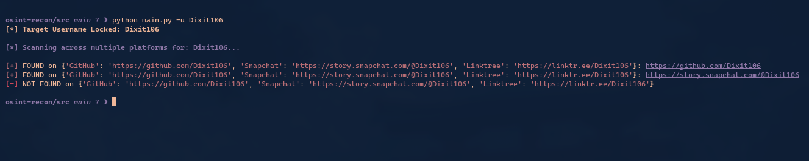
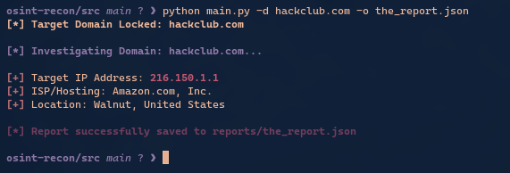
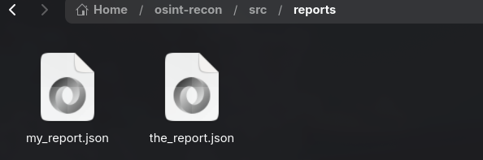
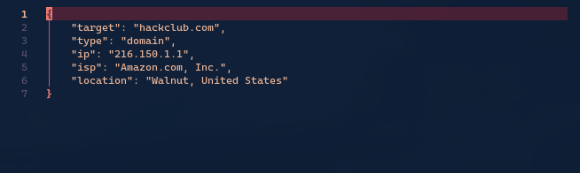

# OSINT-RECON

# Why I Made This Project
Everyone who is into tech has at least once thought about being a hacker or doing hacking stuff for fun. I mean, hacking feels like a very cool power that we can have. Just to get a bit of a taste of cybersecurity and hacking, I decided to build a simple OSINT (Open Source Intelligence) tool using Python.

# What Even Is This Project
This project is a small OSINT tool that uses Python as its core programming language. Using this tool, I can search for a specific "xyz" username across different websites (like GitHub, Snapchat, Linktree) to see if that person exists there. I can also use this tool to investigate domains—finding the exact IP address of a website, details about its hosting provider, and the country/state it is being hosted from.

In tech terms this tool automates basic target footprinting, domain infrastructure analysis, and intelligence logging into structured JSON reports.

While you could do some of this manually on a search engine, this tool automates the repetitive work. More importantly, it is built to be a foundation. Because it exports data cleanly to a JSON file, any developer can easily add more APIs and website URLs to the code to make it a massive, highly useful intelligence tool.

**More on how it works side:-**

Python: The core programming language tying it all together.

Networking (socket & requests): I used Python's built-in socket library to translate website names (like example.com) into real IP addresses. Then, I used the requests library to ping social media sites to see if a username page actually exists (checking if the website returns a '200 OK' or a '404 Not Found').

IP-API: A free geolocation API used to trace where a target IP address is physically located in the real world.

Rich (UI): A Python library I added to make the terminal output colorful, formatted, and easy to read.


# Built With

**Curiosity**: Hackers are cool(good ones) that's why I wanted to larp.

**Python**: The core programming language.

**API**: Free API's to get info 


***Images***










# How to Contribute

To contribute, you can use this code as foundation for your own project and tool which I can perhaps take inspiration from...

**Feedback:** If you ever try to use this tool and get ideas how small things can improve this tool then pls do share.

**Share Tips:** Share few tips with me that might help me to make a better project next time or even improve this one.


# Clone repo


**Clone the repository:**

```Bash
git clone https://github.com/Dixit106/osint-recon
```
After you have files for this project you can open terminal use "cd" to open this folder and type python main.py -u "xyzusername" to get started. You will understand more when you actually use this tool.

Important:- You will have to create and activate venv environment which means this feature will make a seprate environment where you can install python librarys which will not mess with your other projects. 
```Bash
python -m venv .venv
source .venv/bin/activate
pip install requests rich
```

Use -d for domain, -u for username and -o for report
```Bash
python main.py -u "target_username"
python main.py -d "target_website(eg.hackclub.com)" -o "report.json"
```
